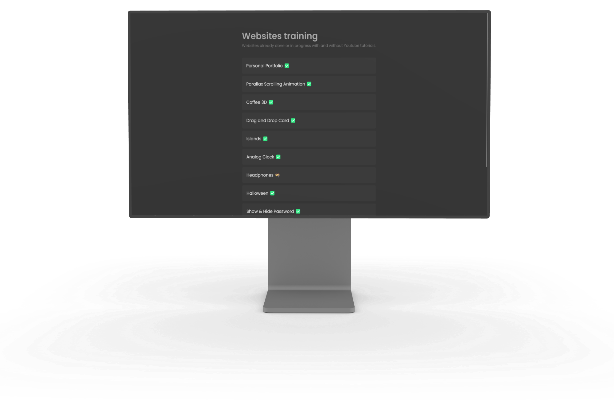
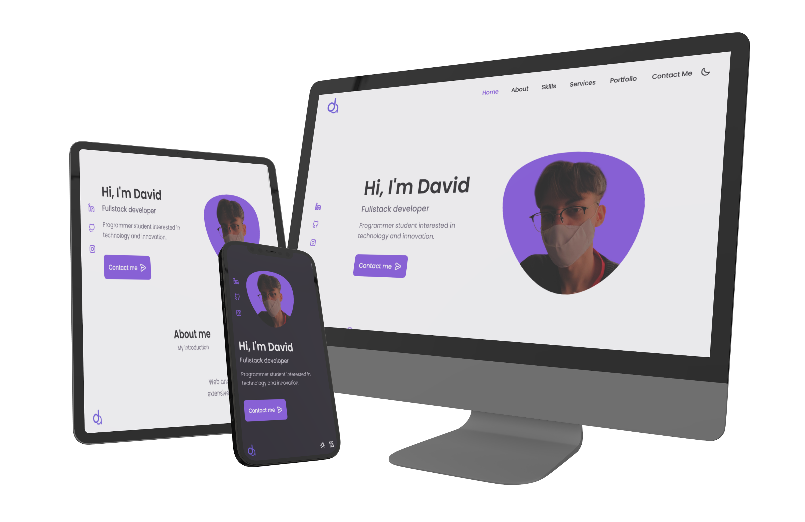
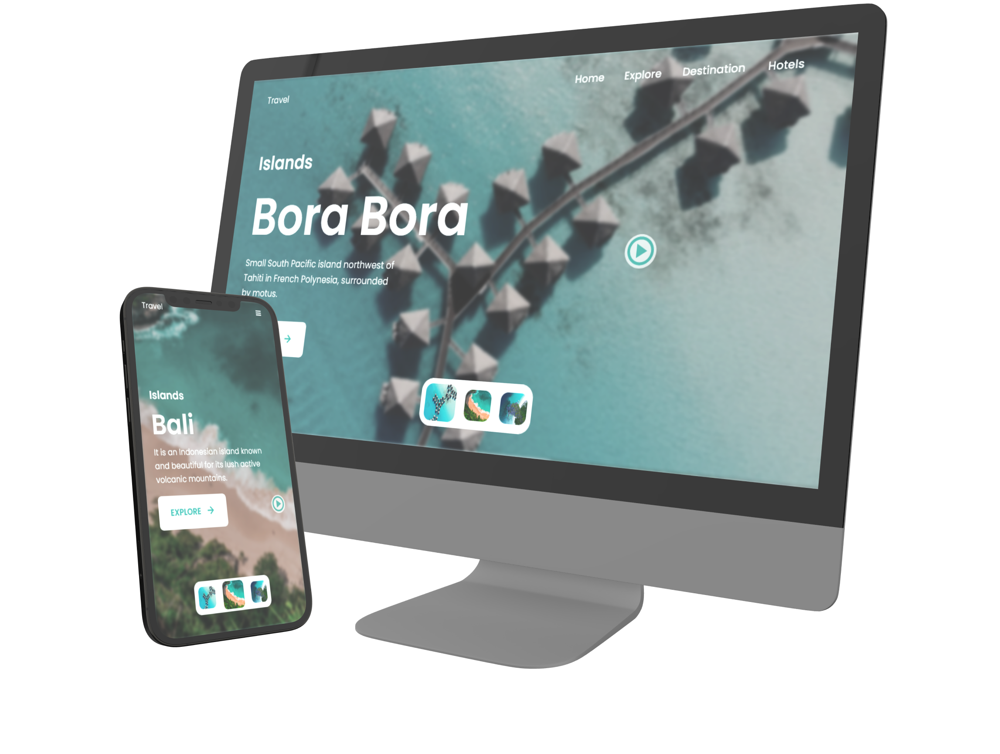
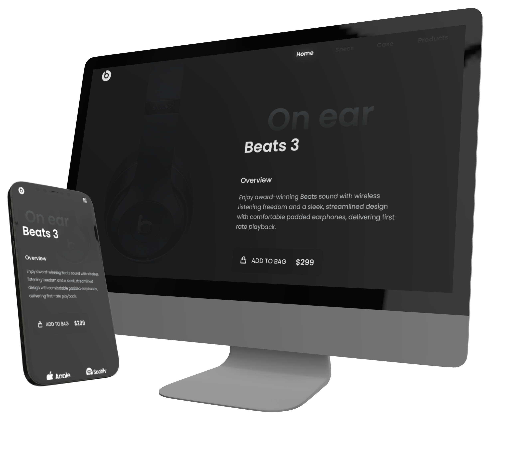

  <a href="#-Objetivo">Objetivo</a>&nbsp;&nbsp;&nbsp;|&nbsp;&nbsp;&nbsp;
  <a href="#-Tecnologias">Tecnologias</a>&nbsp;&nbsp;&nbsp;|&nbsp;&nbsp;&nbsp;
  <a href="#-Projetos">Projetos</a>

    
    

  

 

### 🤳 Objetivo

O objetivo desse repositório é treinar skills básicas, como HTML semântico e as tecnologias do CSS, como o flex, grid etc. Ademais, testar novos layouts e boas práticas de User Interface e User Experience. A maioria dos projetos são feitos com a metodologia Mobile First e junto de um programador que faz vídeos para o youtube, o [Bedimcode](https://www.youtube.com/c/Bedimcode).

 

### 🚀 Tecnologias

- [HTML](https://www.w3schools.com/html/)
- [CSS](https://www.w3schools.com/css/)
- [SASS](https://sass-lang.com/)
- [JS](https://developer.mozilla.org/pt-BR/docs/Web/JavaScript/)

 

### 🖥️ Projetos

Todos os projetos estão hospedados no GitHub Pages: https://almeida154.github.io/websites-training/

 

    Personal Portfolio

    

 

    Parallax Scrolling Animation

    

 

    Coffee (3D)

    

 

    Islands

    

 

    Analog Clock

    

 

    Headphones

    

 

    Halloween

    

